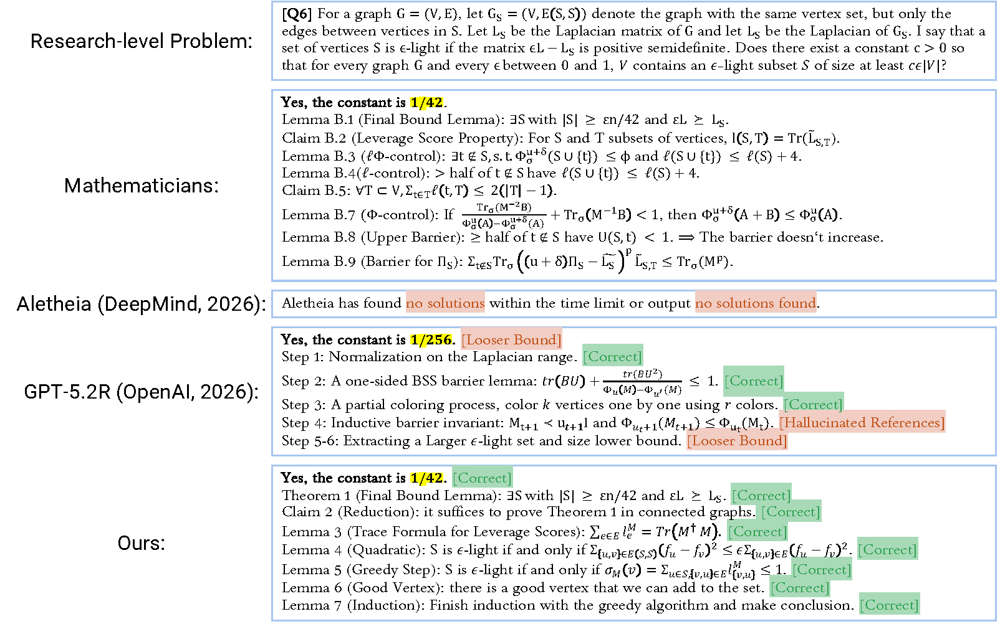
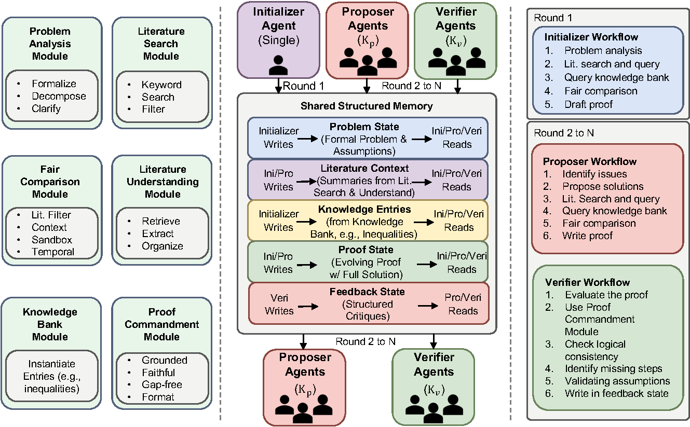

# RMA: an Agentic System for Research-Level Mathematical Problems

[[Paper (arXiv)](https://arxiv.org/abs/2605.22875)]

Official code release for **RMA**.
RMA is a research math agent system that turns problem statements into verifiable proof artifacts.

- Multi-agent iterative workflow (`initializer -> proposer -> verifier -> refiner`).
- Benchmark-oriented repository with problem sets and merged final solutions.
- Reproducible outputs in structured artifacts (e.g., LaTeX/PDF + machine-readable files).

## Abstract

We present **Research Math Agents (RMA)**, an agentic framework for automated reasoning on research-level mathematical problems. Unlike prior studies centered on competition mathematics or formal theorem proving, RMA targets research-level mathematical problems that require long-horizon reasoning, literature grounding, and iterative proof refinement. RMA decomposes research-level proof solving into specialized modules for problem analysis, literature search and understanding, fair comparison, knowledge-bank construction, and proof verification, all coordinated by initializer, proposer, and verifier agents through a shared structured memory. Within this unified framework, these agents operate in a multi-role, multi-round workflow, collaboratively generating, refining, and verifying candidate proofs through iterative feedback. We evaluate RMA on the First Proof benchmark, which consists of ten research-level problems contributed by expert mathematicians across diverse domains. Through comprehensive expert evaluation, RMA outperforms strong baselines on the First Proof benchmark, including GPT-5.2R and Aletheia, solving eight out of ten research problems and producing more logically sound and readable proofs. Our comprehensive ablation studies further show that performance gains arise from the interaction of structured reasoning modules, iterative refinement, and verifier-based feedback, rather than any single component.



---

## Overview



RMA targets **research-level mathematics** (not just competition math or formal theorem proving) by combining specialized modules for:
- problem analysis,
- literature search and understanding,
- fair comparison,
- knowledge-bank construction, and
- proof verification.

Within a multi-role, multi-round workflow, initializer/proposer/verifier agents share structured memory to iteratively generate, refine, and validate candidate proofs. On the First Proof benchmark, RMA reports stronger results than strong baselines through structured modules, iterative refinement, and verifier feedback.

---

## Repository Structure

- `problems/`: benchmark problem statements.
- `skills/`: project skills for math reasoning/research.
- `final_solutions/`: published/reference proof artifacts; these are **not solver inputs**.
- `output_solutions/`: solver outputs, renamed from the earlier `skill_solutions/` layout.
- `rma/`: command-line tooling for the executable RMA pipeline.
- `webapp/`: live agent web app — Question/Issue/Agent/Documents UI, an
  API-or-subscription solver, run control, and an autonomous daily worker
  (see [webapp/README.md](webapp/README.md)).
- `documents/`: daily reports written by the autonomous worker, surfaced in the
  web app's Documents tab.
- `config/default.yaml`: default project paths and execution tier presets.
- `main.tex` and related TeX files: the paper source.

A unified executable pipeline is being built incrementally; see [TODO.md](TODO.md) for the remaining engineering roadmap.

---

## CLI

The CLI command is `rma`, short for Research Math Agent. During development, commands can be run without installation:

```bash
python -m rma doctor
```

For a local editable install that exposes the `rma` command:

```bash
python -m pip install -e .
rma doctor
```

### Staged Pipeline

The executable pipeline is:

```text
parse -> propose -> verify -> refine
```

Each stage can be run directly. Later stages automatically initialize missing earlier artifacts in the same run folder.

```bash
rma parse q6
rma propose q6
rma verify q6
rma refine q6
```

All four stage commands accept the same experiment/model folder controls:

```bash
rma parse q6 --exp-name proofs_v1_june13 --model-name rma-skeleton
rma propose q6 --exp-name proofs_v1_june13 --model-name rma-skeleton
rma verify q6 --exp-name proofs_v1_june13 --model-name rma-skeleton
rma refine q6 --exp-name proofs_v1_june13 --model-name rma-skeleton
```

Stage outputs:

- `rma parse`: copies the problem file and writes `parsed_problem.json` plus `problem_analysis.md`.
- `rma propose`: writes `qN_solution.tex` and versioned proposal artifacts.
- `rma verify`: checks the current solution, renders PDF by default, and writes verification reports. Verification includes LaTeX/artifact checks and mathematical-completeness gates for proof length, subclaim structure, subproofs, theorem hypothesis audits, citations or derivations, and boundary-case proofs.
- `rma refine`: consumes the latest verification report and rewrites the current solution only when issues were found.

### `rma solve`

`rma solve` is the core solver API. It orchestrates `parse -> propose -> verify`, calls `refine` when verification fails, and repeats verifier/refiner rounds up to `--max-rounds`. A run is marked `verified` only when the verifier passes both artifact checks and mathematical-completeness gates.

Solve one First Proof problem:

```bash
rma solve q6
```

Solve all First Proof problems:

```bash
rma solve --all
rma solve --all --exp-name proofs_test_all_june13 --model-name rma-skeleton
```

Choose an execution tier to record in the run metadata:

```bash
rma solve q6 --tier budget
rma solve q6 --tier standard
rma solve q6 --tier pro
```

Choose the experiment/model output folder:

```bash
rma solve q6 --exp-name proofs_v1_june13 --model-name rma-skeleton
```

### Claude Backends

RMA supports two Claude routes.

Use the Anthropic API when you have a Claude Console API key:

```bash
export ANTHROPIC_API_KEY="<your Anthropic API key>"
rma solve q6 --exp-name proofs_claude_june14 --model-name claude-sonnet-4-6
rma solve --all --exp-name proofs_claude_all_june14 --model-name claude-sonnet-4-6 --max-rounds 3
```

On macOS, RMA also checks the local Keychain service `rma_anthropic_api_key` when `ANTHROPIC_API_KEY` is not set:

```bash
security add-generic-password -U -a "$USER" -s rma_anthropic_api_key -w "<your Anthropic API key>"
rma solve q6 --exp-name proofs_claude_june14 --model-name claude-sonnet-4-6
```

With `--model-provider auto`, any `claude-*` model name uses the Anthropic Messages API. You can force the same backend explicitly:

```bash
rma propose q6 --model-provider anthropic --model-name claude-opus-4-8
rma solve q6 --model-provider anthropic --model-name claude-opus-4-8
```

Use Claude Code when you want to run through a local Claude Code login, including a Pro/Max subscription-backed login:

```bash
claude
# complete browser login if prompted

rma solve q6 --model-provider claude-code --model-name claude-code --exp-name proofs_cc_june14
rma solve --all --model-provider claude-code --model-name claude-code-sonnet --exp-name proofs_cc_all_june14 --max-rounds 3
```

`claude-code` uses the installed `claude -p` non-interactive CLI. If `ANTHROPIC_API_KEY` is set, Claude Code may prefer API-key billing; unset it when you want the local Claude Code session to use subscription allocation.

Use the project math-research skill instructions:

```bash
rma solve q6 --skill-path skills/math-research/SKILL.md
```

By default, `rma solve` loads `skills/math-research/SKILL.md` and records the skill name/path in each problem's metadata and report. The skill provides the proof-development procedure: problem analysis, strategy choice, proof commandments, gap audit, verification protocol, and LaTeX conventions.

Render behavior:

```bash
rma solve q6                 # writes q6_solution.tex and q6_solution.pdf
rma solve q6 --no-render     # writes only q6_solution.tex
```

Control verifier/refiner loop length:

```bash
rma solve q6 --max-rounds 3
```

The output folder follows the earlier solution-folder convention:

```text
output_solutions/<exp-name>_<model-name>/
```

For example:

```text
output_solutions/proofs_v1_june13_rma-skeleton/
```

The current `solve` implementation initializes the output directory, records the fairness boundary, loads the math-research skill, writes solution artifacts, runs verifier checks, renders PDFs by default, and calls the refiner when checks fail. The built-in `rma-skeleton` proposer/refiner is deterministic and profile-guided; it is useful for pipeline testing but is not yet strong enough to solve all First Proof problems in full. For real proof generation, select a Claude backend as shown above.

Single-problem output structure:

```text
output_solutions/proofs_v1_june13_rma-skeleton/
  q6_solution.tex
  q6/
    input/
      problem.tex
    artifacts/
      metadata.json
      status.json
      report.md
      parsed_problem.json
      problem_analysis.md
      proposals/
        proposal_001.tex
        proposal_001.json
      verifications/
        verification_001.json
        verification_001.md
      refinements/
  q6_solution.pdf
```

All-problem output structure:

```text
output_solutions/proofs_test_all_june13_rma-skeleton/
  q1_solution.tex
  q1_solution.pdf
  ...
  q10_solution.tex
  q10_solution.pdf
  q1/
    input/problem.tex
    artifacts/metadata.json
    artifacts/status.json
    artifacts/report.md
    artifacts/parsed_problem.json
    artifacts/proposals/proposal_001.tex
    artifacts/verifications/verification_001.json
  ...
  q10/
    input/problem.tex
    artifacts/metadata.json
    artifacts/status.json
    artifacts/report.md
    artifacts/parsed_problem.json
    artifacts/proposals/proposal_001.tex
    artifacts/verifications/verification_001.json
```

Example output:

```text
RMA solve
tier: standard
skill: skills/math-research/SKILL.md
status: needs_refinement
output: output_solutions/proofs_v1_june13_rma-skeleton
solution: output_solutions/proofs_v1_june13_rma-skeleton/q6_solution.tex
problem_status: needs_refinement
rendered: output_solutions/proofs_v1_june13_rma-skeleton/q6_solution.pdf
verification: output_solutions/proofs_v1_june13_rma-skeleton/q6/artifacts/verifications/verification_003.json

Completed parser -> proposer -> verifier/refiner solve pipeline.
No official/prior solution directories were read.
```

All-problem example output:

```text
RMA solve
tier: standard
skill: skills/math-research/SKILL.md
status: needs_refinement
output: output_solutions/proofs_test_all_june13_rma-skeleton
solution: output_solutions/proofs_test_all_june13_rma-skeleton/q1_solution.tex
problem_status: needs_refinement
rendered: output_solutions/proofs_test_all_june13_rma-skeleton/q1_solution.pdf
verification: output_solutions/proofs_test_all_june13_rma-skeleton/q1/artifacts/verifications/verification_003.json
...
solution: output_solutions/proofs_test_all_june13_rma-skeleton/q6_solution.tex
problem_status: needs_refinement
rendered: output_solutions/proofs_test_all_june13_rma-skeleton/q6_solution.pdf
verification: output_solutions/proofs_test_all_june13_rma-skeleton/q6/artifacts/verifications/verification_003.json
```

### `rma doctor`

`rma doctor` checks whether the local checkout has the files and tools needed for RMA development.

Example:

```bash
rma doctor
```

---

## Web App

A browser app that runs a Claude-powered agent over the benchmark and streams
every step live — modeled on TheAgentCompany (a thin agent loop over a model,
plus a questions/issues workspace), pointed at research mathematics. Full
details in [webapp/README.md](webapp/README.md).

```bash
pip install -e ".[webapp]"     # fastapi + uvicorn (+ anthropic for API mode)
python -m webapp               # serves http://127.0.0.1:8000 (HOST/PORT overridable)
```

On a Linux server, forward the port to your laptop:

```bash
ssh -L 8000:localhost:8000 user@server     # then open http://localhost:8000
```

**Features:**

- **Four tabs per question** — *Question* (the `.tex` statement, KaTeX-rendered
  or raw), *Issue* (an editable per-question markdown tracker with an agent-run
  activity log), *Agent* (run the solver live), and *Documents* (browse daily
  reports).
- **Two ways to call Claude:**
  - **Claude Code (subscription)** — drives the local `claude` CLI in headless
    mode, so runs draw from your **Pro/Max subscription, not API credits**
    (the answer to "the API is too expensive"). Requires `claude login` on the
    server; the app keeps `ANTHROPIC_API_KEY` unset for the CLI so subscription
    auth is used.
  - **Anthropic API** — the native Messages API tool-use loop (streaming,
    adaptive thinking, prompt caching), billed per token via `ANTHROPIC_API_KEY`.
- **Live step-by-step stream** — thinking, assistant text with rendered math,
  every tool call + result, the final `solution.tex` artifact, and token/cost.
- **Real run control** — the **Stop** button calls `POST /api/cancel`, which
  kills the backend process group (the `claude` CLI plus its node child), so a
  stopped run stops consuming your subscription immediately. The sidebar's
  **Active runs** panel lists every in-flight run (interactive and daily) with a
  per-run Stop button, for watching/controlling parallel runs.
- **PDF preview** — compile a `solution.tex` to PDF and preview it inline (Agent
  tab "Compile PDF"; daily reports link the compiled PDF). Requires a LaTeX
  toolchain on the server (the one that builds `main.tex`); degrades gracefully
  otherwise.
- **Autonomous daily worker** — `python -m webapp.daily` runs the agent once a
  day with no human in the loop (subscription-backed), writes a dated report to
  `documents/`, and logs each run to the question's issue. Runs as a daemon
  (`--now`/scheduled) or once (`--once`, for cron); configurable via
  `RMA_DAILY_AT`, `RMA_DAILY_PROBLEMS`, `RMA_DAILY_MODEL`. You can also trigger a
  run from the Documents tab.
- **Sandboxing / contamination boundary** — every file tool and the daily worker
  honor the blocked-input rule below: the agent can read `problems/`, `skills/`,
  and its own scratch workspace, but never the blocked solution directories.

---

## Solver Contamination Boundary

The solver must treat First Proof official solutions and prior AI-generated solutions as blocked input material. When implementing or running `rma solve`, the solving process may read problem statements from `problems/` and project instructions from `skills/`, but it must not read, grep, glob, summarize, render, or otherwise use existing files under:

- `final_solutions/`
- `output_solutions/`
- `baselines/`
- public First Proof official-solution pages or derivative solution writeups

`output_solutions/` is allowed as a write destination for new solve outputs. Same-run artifacts created by `rma parse`, `rma propose`, `rma verify`, and `rma refine` may be consumed by later stages in that same selected run folder. Prior output folders and unrelated existing solution artifacts remain blocked solver context. Existing final proof artifacts may remain in the repository for release/reference purposes, but they are outside the context available to a fair solve run.

The primary solver API is:

```bash
rma solve q6
rma solve --all
```

`rma solve q6` reads from `problems/q6.tex` only and writes fresh artifacts under `output_solutions/`. `rma solve --all` runs the same benchmark-fair process over all First Proof problem files.

---

## Paper Build

To compile the paper:

```bash
latexmk -pdf -interaction=nonstopmode -halt-on-error main.tex
```

---

## Acknowledgement

We thank **PoggioAI** for open-sourcing `PoggioAI_MSc`, which inspired the system-organization direction and README structure of this project.

---

## Citation

```bibtex
@article{zhao2026rma,
  title={RMA: an Agentic System for Research-Level Mathematical Problems},
  author={Zhao, Zelin and Yuan, Bo and Choi, Jaemoo and Chen, Yongxin},
  journal={arXiv preprint arXiv:2605.22875},
  year={2026}
}
```
