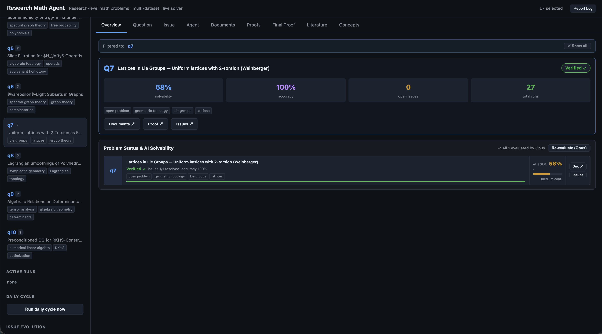

# RMA: an Agentic System for Research-Level Mathematical Problems

<div align="center">

[](https://arxiv.org/abs/2605.22875)
[](https://github.com/sjtuytc/ResearchMathAgent/stargazers)
[](https://github.com/sjtuytc/ResearchMathAgent/network/members)
[](LICENSE)
[](https://python.org)
[](https://github.com/sjtuytc/ResearchMathAgent/pulls)

**Language:** English | [中文](README_zh.md)

</div>

---

## Highlights

> RMA is the first agentic framework that targets **research-level mathematical proof** — not competition problems, not formal theorem proving — by combining specialized agents, structured memory, and iterative verifier feedback.

| Feature | Detail |
|---------|--------|
| **Research-level problems** | First Proof benchmark: 10 open-math problems from expert mathematicians across 10 distinct fields |
| **Multi-agent pipeline** | Initializer → Proposer → Verifier → Refiner, coordinated through shared structured memory |
| **State-of-the-art results** | Solves **8 / 10** First Proof problems; outperforms GPT-5.2R and Aletheia |
| **Two Claude backends** | Anthropic Messages API (pay-per-token) *or* Claude Code local CLI (Pro/Max subscription) |
| **Live web UI** | Streaming step-by-step viewer, live PDF preview, per-question issue tracker, token cost display |
| **Autonomous daily worker** | Runs the solver overnight with no human in the loop, writes dated reports to `documents/` |
| **Benchmark-fair sandbox** | Contamination boundary enforced in code — prior solutions are never read by the solver |
| **Agentic GitHub Issues API** | REST API (`/api/gh/issues`) so multiple agents can coordinate on real GitHub Issues |

---

## Abstract

<details>
<summary>Read full abstract</summary>

We present **Research Math Agents (RMA)**, an agentic framework for automated reasoning on research-level mathematical problems. Unlike prior studies centered on competition mathematics or formal theorem proving, RMA targets research-level mathematical problems that require long-horizon reasoning, literature grounding, and iterative proof refinement. RMA decomposes research-level proof solving into specialized modules for problem analysis, literature search and understanding, fair comparison, knowledge-bank construction, and proof verification, all coordinated by initializer, proposer, and verifier agents through a shared structured memory. Within this unified framework, these agents operate in a multi-role, multi-round workflow, collaboratively generating, refining, and verifying candidate proofs through iterative feedback. We evaluate RMA on the First Proof benchmark, which consists of ten research-level problems contributed by expert mathematicians across diverse domains. Through comprehensive expert evaluation, RMA outperforms strong baselines on the First Proof benchmark, including GPT-5.2R and Aletheia, solving eight out of ten research problems and producing more logically sound and readable proofs. Our comprehensive ablation studies further show that performance gains arise from the interaction of structured reasoning modules, iterative refinement, and verifier-based feedback, rather than any single component.

</details>


---

## Overview


RMA targets **research-level mathematics** (not competition math or formal theorem proving) by combining specialized modules for problem analysis, literature search and understanding, fair comparison, knowledge-bank construction, and proof verification.

Within a multi-role, multi-round workflow, initializer/proposer/verifier agents share structured memory to iteratively generate, refine, and validate candidate proofs. On the First Proof benchmark, RMA reports stronger results than strong baselines through structured modules, iterative refinement, and verifier feedback.

---

## Quick Start

```bash
# 1. Install
pip install -e ".[webapp]"

# 2. Set API key (or use Claude Code subscription — see Claude Backends below)
export ANTHROPIC_API_KEY="<your key>"

# 3. Solve a problem
rma solve q6 --model-name claude-opus-4-8

# 4. Launch the web UI
python -m webapp          # → http://127.0.0.1:8000
```


*Overview tab: problem listing, solvability metrics, solver status, and daily worker controls.*

---

## Repository Structure

<details>
<summary>Expand file tree</summary>

```
ResearchMathAgent/
├── problems/             # Benchmark problem statements (q1..q10 .tex files)
├── skills/               # Math-research skill instructions for the solver
├── final_solutions/      # Published/reference proofs — NOT solver inputs
├── outputs/              # Solver outputs (write destination, on shared storage)
├── rma/                  # CLI tooling: parse / propose / verify / refine / solve
├── webapp/               # Live web app (FastAPI + vanilla JS)
│   └── README.md         # Web app details
├── documents/            # Daily reports from the autonomous worker
├── config/default.yaml   # Project paths and execution tier presets
└── main.tex              # Paper source
```

- `problems/` → `final_solutions/` boundary is enforced; the solver never reads prior solutions.
- `outputs/` (symlink to shared storage) is the write destination for all `rma solve` runs.
- See [TODO.md](TODO.md) for the remaining engineering roadmap.

</details>

---

## CLI

Install once for the `rma` command:

```bash
pip install -e .
rma doctor        # health check
```

Or run without installing:

```bash
python -m rma doctor
```

<details>
<summary>Staged pipeline (parse / propose / verify / refine)</summary>

The pipeline is:

```
parse → propose → verify → refine
```

Each stage can be run individually. Later stages auto-initialize missing earlier artifacts.

```bash
rma parse q6
rma propose q6
rma verify q6
rma refine q6
```

With explicit experiment/model controls:

```bash
rma parse q6    --exp-name proofs_v1_june13 --model-name rma-skeleton
rma propose q6  --exp-name proofs_v1_june13 --model-name rma-skeleton
rma verify q6   --exp-name proofs_v1_june13 --model-name rma-skeleton
rma refine q6   --exp-name proofs_v1_june13 --model-name rma-skeleton
```

Stage outputs:

| Stage | Writes |
|-------|--------|
| `parse` | `parsed_problem.json`, `problem_analysis.md` |
| `propose` | `qN_solution.tex`, versioned proposal artifacts |
| `verify` | Verification report (JSON + Markdown), renders PDF |
| `refine` | Rewrites `qN_solution.tex` based on the latest report |

`verify` checks LaTeX/artifact correctness **and** mathematical-completeness gates (proof length, subclaim structure, subproofs, hypothesis audits, citations, boundary-case proofs).

</details>

<details>
<summary>rma solve — full solver loop</summary>

`rma solve` orchestrates `parse → propose → verify` and calls `refine` on failure, repeating up to `--max-rounds`. A run is marked `verified` only when ALL verifier gates pass.

```bash
# Solve one problem
rma solve q6

# Solve all 10 problems
rma solve --all

# Named experiment + skeleton model (pipeline test)
rma solve --all --exp-name proofs_test_all_june13 --model-name rma-skeleton

# Execution tier (recorded in metadata)
rma solve q6 --tier budget      # or standard / pro

# Limit refiner rounds
rma solve q6 --max-rounds 3

# Use math-research skill
rma solve q6 --skill-path skills/math-research/SKILL.md

# Write only .tex (skip PDF render)
rma solve q6 --no-render
```

**Output folder layout:**

```
outputs/first_proof_1/proofs_v1_june13_rma-skeleton/
  q6_solution.tex
  q6_solution.pdf
  q6/
    input/problem.tex
    artifacts/
      metadata.json
      status.json
      report.md
      parsed_problem.json
      problem_analysis.md
      proposals/proposal_001.tex
      verifications/verification_001.json
      refinements/
```

**Example terminal output:**

```
RMA solve
tier: standard
skill: skills/math-research/SKILL.md
status: needs_refinement
output: outputs/first_proof_1/proofs_v1_june13_rma-skeleton
solution: outputs/first_proof_1/proofs_v1_june13_rma-skeleton/q6_solution.tex
verification: .../verification_003.json
```

</details>

<details>
<summary>Claude backends — API key vs subscription</summary>

**Anthropic Messages API** (pay-per-token):

```bash
export ANTHROPIC_API_KEY="<your key>"
rma solve q6 --model-name claude-opus-4-8
rma solve --all --model-name claude-sonnet-4-6 --max-rounds 3
```

On macOS, store the key in Keychain to avoid exporting it:

```bash
security add-generic-password -U -a "$USER" -s rma_anthropic_api_key -w "<key>"
rma solve q6 --model-name claude-sonnet-4-6    # picks up from Keychain
```

Force the API backend explicitly:

```bash
rma solve q6 --model-provider anthropic --model-name claude-opus-4-8
```

**Claude Code** (Pro/Max subscription — no API credits consumed):

```bash
claude                  # complete browser login once
rma solve q6 --model-provider claude-code --model-name claude-code
rma solve --all --model-provider claude-code --model-name claude-code --max-rounds 3
```

`claude-code` drives the local `claude -p` headless CLI. Unset `ANTHROPIC_API_KEY` if you want subscription billing (not API billing).

**Auto-detect:** `--model-provider auto` (default) uses Claude Code for `rma-skeleton` and the Anthropic API for any `claude-*` model name.

</details>

---

## Web App

```bash
pip install -e ".[webapp]"
python -m webapp          # → http://127.0.0.1:8000
```

On a remote server, forward the port:

```bash
ssh -L 8000:localhost:8000 user@server
```

<details>
<summary>Web app feature list</summary>

- **Question tab** — renders the `.tex` problem statement with KaTeX; toggle raw/rendered
- **Issue tab** — GitHub-style per-problem issue tracker (multi-agent comment threads, status, labels); also exposes `/api/gh/issues` for direct GitHub Issues control
- **Agent tab** — run the solver live with streaming thinking + tool calls + rendered math + token cost
- **Documents tab** — browse dated daily reports; trigger a manual agent run
- **Two Claude backends** — API key or local Claude Code subscription (the `claude` CLI in headless mode, so runs draw from your Pro/Max subscription, not API credits)
- **Live step-by-step stream** — every thinking block, assistant text, tool call, and result appear in real time
- **Stop button** — `POST /api/cancel` kills the backend process group immediately, stopping subscription consumption
- **Active runs panel** — lists every in-flight run with per-run Stop buttons for parallel-run control
- **PDF preview** — compile `solution.tex` inline (requires server-side LaTeX); degrades gracefully
- **Token / cost display** — per-turn usage chart and per-card annotation
- **Autonomous daily worker** — `python -m webapp.daily` runs the solver nightly, writes `documents/YYYY-MM-DD.md`, logs each run to the question's issue thread

</details>

<details>
<summary>Agentic GitHub Issues API</summary>

Many solver agents can coordinate on real GitHub Issues via the web app's REST API.  All endpoints are under `/api/gh/`:

| Endpoint | Method | Purpose |
|----------|--------|---------|
| `/api/gh/status` | GET | Token availability + repo name |
| `/api/gh/issues?problem_id=q6` | GET | List issues (filtered by `problem:q6` label) |
| `/api/gh/issues` | POST | Create issue `{problem_id, title, body, labels}` |
| `/api/gh/issues/{n}` | GET | Get issue + comments |
| `/api/gh/issues/{n}/comment` | POST | Add comment `{body}` |
| `/api/gh/issues/{n}` | PATCH | Update `{title, state, labels, body}` |
| `/api/gh/issues/{n}/close` | POST | Close issue |
| `/api/gh/issues/{n}/reopen` | POST | Reopen issue |
| `/api/gh/search?q=...` | GET | GitHub search syntax |

Requires `GITHUB_TOKEN` env var for writes (fine-grained PAT, Issues read/write).  Reads work unauthenticated (60 req/hr).

</details>

---

## Solver Contamination Boundary

<details>
<summary>Fair-evaluation rules</summary>

The solver must treat First Proof official solutions and prior AI-generated solutions as **blocked input**. The solving process may read:

- `problems/` — benchmark problem statements
- `skills/` — math-research skill instructions
- Same-run artifacts (created by earlier stages of the same run)

The solver must **never** read, grep, glob, summarize, render, or otherwise use existing files under:

- `final_solutions/`
- `outputs/`
- `baselines/`
- Public First Proof official-solution pages or derivative writeups

`outputs/` is allowed as a **write** destination only.  Prior output folders and unrelated existing solution artifacts remain blocked solver context.

The primary solver command:

```bash
rma solve q6      # reads problems/q6.tex only; writes fresh artifacts
rma solve --all   # benchmark-fair over all 10 problems
```

</details>

---

## Paper Build

```bash
latexmk -pdf -interaction=nonstopmode -halt-on-error main.tex
```

---

## Acknowledgements

We thank **PoggioAI** for open-sourcing `PoggioAI_MSc`, which inspired the system-organization direction and README structure of this project. We also thank the **[TheAgentCompany](https://github.com/TheAgentCompany/TheAgentCompany)** team for open-sourcing their agent-loop-over-model framework and questions/issues workspace design, which inspired the architecture of the RMA web app. We additionally acknowledge **[Andrej Karpathy](https://github.com/karpathy)**'s [autoresearch](https://github.com/karpathy/autoresearch) project for pioneering the idea of fully automated AI-driven scientific discovery, which served as an important conceptual inspiration for RMA's autonomous solver pipeline.

---

## Star History

[](https://star-history.com/#sjtuytc/ResearchMathAgent&Date)

---

## Citation

```bibtex
@article{zhao2026rma,
  title={RMA: an Agentic System for Research-Level Mathematical Problems},
  author={Zhao, Zelin and Yuan, Bo and Choi, Jaemoo and Chen, Yongxin},
  journal={arXiv preprint arXiv:2605.22875},
  year={2026}
}
```
