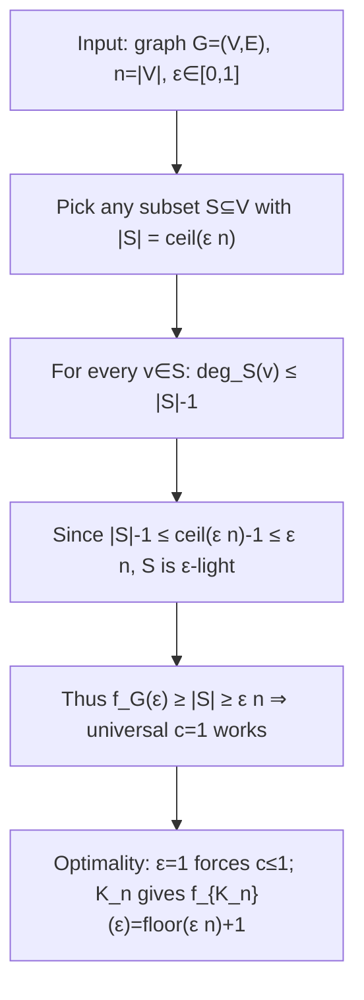
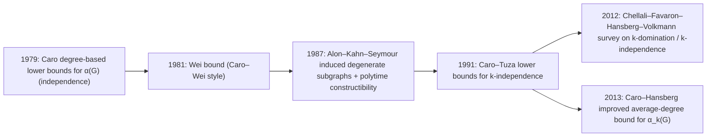

# ε-light vertex subsets under a global-degree threshold

## Executive summary

Under the definition you specified—an **ε-light** set \(S\subseteq V\) satisfies \(\deg_S(v)\le \varepsilon |V|\) for every \(v\in S\)—the existence of a linear-size ε-light set is **immediate** and the best universal constant is exactly
\[
c^\star = 1.
\]

The key observation is that for any vertex subset \(S\), every vertex in \(S\) has at most \(|S|-1\) neighbors **inside** \(S\). Thus **any** subset of size \(|S|\le \varepsilon n+1\) (where \(n=|V|\)) is automatically ε-light, independent of the edge set. Choosing \(|S|=\lceil \varepsilon n\rceil\) gives \(|S|\ge \varepsilon n\) and ensures \(\deg_S(v)\le |S|-1\le \varepsilon n\). This yields a universal constant \(c=1\) for all graphs and all \(\varepsilon\in[0,1]\).

Optimality is also immediate: no constant \(c>1\) can work because taking \(\varepsilon=1\) would require \(|S|\ge c n>n\). Moreover, the complete graph \(K_n\) shows that you generally **cannot** guarantee \(|S|\) much larger than \(\varepsilon n\): in \(K_n\), every induced subgraph on \(m\) vertices has maximum internal degree \(m-1\), so ε-lightness forces \(m-1\le \varepsilon n\), i.e. \(m\le \lfloor \varepsilon n\rfloor+1\).

So the worst-case asymptotics are completely pinned down:
\[
\inf_{G:\,|V(G)|=n} f_G(\varepsilon) \;=\; \min\{n,\lfloor \varepsilon n\rfloor+1\},
\]
where \(f_G(\varepsilon)\) is the maximum size of an ε-light subset in \(G\).

The remainder of this report (i) formalizes the above as a theorem, (ii) places your \(f_G(\varepsilon)\) in the context of the literature on **\(k\)-independence / \(k\)-dependence** (induced subgraphs of bounded maximum degree), and (iii) compares behavior across graph families, including dense graphs, complete multipartite graphs, expanders, and random graphs. For the algorithmic aspect, the “find the largest ε-light set” optimization problem is a special case of the **maximum induced subgraph** problem for a hereditary property and is NP-hard in general. citeturn2view1turn7view0turn2view0

## Definitions and reformulations

Let \(G=(V,E)\) be a finite simple undirected graph with \(n=|V|\). For \(S\subseteq V\), write \(G[S]\) for the induced subgraph on \(S\), and \(\deg_S(v)\) for the degree of \(v\) *in* \(G[S]\). This induced-subgraph notation and the internal-degree notation \(\deg_S(v)\) are standard and explicitly used in the \(k\)-independence literature. citeturn2view1

### ε-light sets and the extremal function \(f_G(\varepsilon)\)

You defined \(S\) to be **ε-light** if
\[
\forall v\in S,\quad \deg_S(v)\le \varepsilon n.
\]
Define
\[
f_G(\varepsilon)\;:=\;\max\{|S|:\; S\subseteq V,\; \Delta(G[S])\le \varepsilon n\},
\]
where \(\Delta(H)\) denotes maximum degree of graph \(H\).

### Connection to “\(j\)-independence” / “\(k\)-independence” (bounded induced maximum degree)

A widely studied generalization of independence is: a set \(S\) is **\(k\)-independent** (also called \(k\)-dependent in some domination literature) if the induced subgraph \(G[S]\) has maximum degree at most \(k\). This is exactly the same structural condition as your ε-lightness, but with a fixed integer threshold \(k\) instead of \(\varepsilon n\). citeturn2view1turn8view0turn9view0

Therefore, writing \(k=\lfloor \varepsilon n\rfloor\),
\[
f_G(\varepsilon) \;=\; \alpha_k(G),
\]
where \(\alpha_k(G)\) denotes the maximum size of a \(k\)-independent set (in the “induced max-degree ≤ \(k\)” sense). citeturn2view1turn8view0turn9view0

A useful meta-point: because your threshold scales with \(n\), many “hard” extremal effects seen when \(k\) is fixed disappear; the trivial lower bound \(\alpha_k(G)\ge k+1\) already becomes linear in \(n\) when \(k=\Theta(n)\).

### A one-page proof pipeline (diagram)

## Universal constant, best value, and tight extremal examples

### Existence and best constant

**Theorem (universal constant exists, and \(c^\star=1\)).**  
There exists a universal constant \(c>0\) such that for every finite simple graph \(G\) on \(n\) vertices and every \(\varepsilon\in[0,1]\), \(G\) contains an ε-light set \(S\) with \(|S|\ge c\,\varepsilon n\). The best possible value is \(c^\star=1\).

**Proof (existence with \(c=1\)).**  
Fix \(G\) and \(\varepsilon\). Choose any subset \(S\subseteq V\) with \(|S|=\lceil \varepsilon n\rceil\) (always possible). For any \(v\in S\),
\[
\deg_S(v)\le |S|-1=\lceil \varepsilon n\rceil-1\le \varepsilon n,
\]
because if \(\varepsilon n\) is an integer then \(\lceil \varepsilon n\rceil-1=\varepsilon n-1\), and otherwise \(\lceil \varepsilon n\rceil-1=\lfloor \varepsilon n\rfloor\le \varepsilon n\). Hence \(S\) is ε-light and \(|S|=\lceil \varepsilon n\rceil\ge \varepsilon n\), proving the claim with \(c=1\).

**Proof (optimality).**  
If \(\varepsilon=1\), the requirement becomes “there exists \(S\subseteq V\) with \(|S|\ge c\cdot n\)” because \(\deg_S(v)\le n\) holds for all \(S\) in a simple graph. Since \(|S|\le n\), we must have \(c\le 1\). Therefore \(c^\star\le 1\). Combined with the construction above, \(c^\star=1\).

This is essentially a “ceiling/degree” argument; no structural property of \(G\) is used beyond the fact that induced degree is bounded by \(|S|-1\).

### Exact worst-case behavior across all graphs

Let
\[
f_{\min}(n,\varepsilon)\;:=\;\min\{f_G(\varepsilon):\; |V(G)|=n\}.
\]

**Proposition (exact worst case).**
\[
f_{\min}(n,\varepsilon)=\min\{n,\lfloor \varepsilon n\rfloor+1\}.
\]

**Sketch.**
- Lower bound: the existence proof above gives \(f_G(\varepsilon)\ge \lceil \varepsilon n\rceil\), hence \(f_G(\varepsilon)\ge \lfloor \varepsilon n\rfloor+1\) for all \(G\).
- Upper bound via extremal construction: for the complete graph \(K_n\), any \(S\) of size \(m\) satisfies \(\deg_S(v)=m-1\) for all \(v\in S\), so ε-lightness forces \(m-1\le \varepsilon n\), i.e. \(m\le \lfloor \varepsilon n\rfloor+1\). Thus \(f_{K_n}(\varepsilon)=\min\{n,\lfloor \varepsilon n\rfloor+1\}\), matching the universal lower bound.

This pins down the “best possible universal guarantee” exactly; the obstruction is simply the clique.

## Bounds and known results for \(f_G(\varepsilon)\) via \(k\)-independence and induced bounded-degree subgraphs

Although the universal constant question is settled by the trivial induced-degree bound, your requested “deep research” attributes naturally align with the literature around **\(k\)-independent** sets (maximum induced subgraph of bounded maximum degree).

### Trivial but fundamental lower bound: \(\alpha_k(G)\ge \min\{n,k+1\}\)

For any integer \(k\ge 0\) and any graph \(G\), **any** set of \(k+1\) vertices induces maximum degree at most \(k\) (since \(\Delta(G[S])\le |S|-1=k\)). Thus \(\alpha_k(G)\ge \min\{n,k+1\}\). Under your scaling \(k=\lfloor \varepsilon n\rfloor\), this becomes \(\alpha_k(G)\ge \Theta(\varepsilon n)\), yielding \(c^\star=1\) as above.

In the general \(k\)-independence literature, this lower bound is mentioned as the baseline that degree-sequence or average-degree methods try to improve upon when \(k\) is fixed and \(n\to\infty\). citeturn2view1turn9view0

### Degree-sequence and average-degree lower bounds (Caro–Tuza, Caro–Hansberg)

A large body of work generalizes the classical independence-number bounds (e.g., Caro–Wei) to \(\alpha_k(G)\), the maximum size of an induced subgraph with \(\Delta\le k\). The paper by entity["people","Yair Caro","graph theorist"] and entity["people","Adriana Hansberg","graph theorist"] defines \(k\)-independence as “maximum degree in \(G[S]\) at most \(k\)” and proves an average-degree lower bound of the form
\[
\alpha_k(G) > \frac{k+1}{\lceil d(G)\rceil+k+1}\,n,
\]
improving earlier general bounds due to entity["people","Zsolt Tuza","graph theorist"] and others. citeturn2view1turn3search12

For your scaling \(k=\lfloor \varepsilon n\rfloor\), this implies (crudely) that in graphs with average degree \(d(G)=\Theta(n)\), one typically expects \(\alpha_k(G)=\Theta(n)\) with proportionality depending on the density constant—consistent with the heuristic calculations for random-like dense graphs later.

### Induced degeneracy results (Alon–Kahn–Seymour) as a superset tool

The classic paper on “large induced degenerate subgraphs” by entity["people","Noga Alon","mathematician"], entity["people","Jeff Kahn","mathematician"], and entity["people","Paul Seymour","graph theorist"] gives strong degree-sequence lower bounds for the largest induced \(d\)-degenerate subgraph and notes polynomial-time constructibility of such subgraphs. citeturn2view2

Since “maximum degree \(\le k\)” implies “\(k\)-degenerate”, degeneracy bounds can sometimes be used as relaxations (they certify the existence of large induced low-degeneracy subgraphs, which is weaker than induced low-maximum-degree). For your problem, these are not needed for existence, but they are relevant if one studies relaxed versions such as bounding **average** internal degree rather than maximum internal degree.

### Defective coloring as a structural lens (not needed for \(c^\star\), but relevant context)

A \((q,d)\)-defective coloring partitions \(V\) into \(q\) color classes each inducing maximum degree \(\le d\). citeturn0search1turn0search27  
This implies that some color class has size at least \(n/q\) and induced maximum degree \(\le d\). Conceptually, your problem asks for existence of *one* large low-induced-degree class—i.e., one color class—under a global threshold \(d=\varepsilon n\). The threshold is so large that defective-coloring theory is overkill for the universal constant statement, but becomes relevant in variants where (i) \(d\) is fixed, or (ii) one wants multiple disjoint ε-light sets.

## Extremal constructions and representative graph families

This section compares exact and asymptotic \(f_G(\varepsilon)\) behavior across common graph families, with attention to “achievable constants” in the sense of the ratio \(f_G(\varepsilon)/(\varepsilon n)\).

### A comparison table

Let \(n=|V|\). The table uses \(f_G(\varepsilon)=\max\{|S|:\Delta(G[S])\le \varepsilon n\}\).

| Graph family \(G\) | Typical / exact \(f_G(\varepsilon)\) | Ratio \(f_G(\varepsilon)/(\varepsilon n)\) (when meaningful) | Extremal notes |
|---|---:|---:|---|
| Complete graph \(K_n\) | \(\min\{n,\lfloor \varepsilon n\rfloor+1\}\) | \(\approx 1\) for fixed \(\varepsilon>0\) | **Worst case** over all graphs; forces \(c^\star\le 1\). |
| Empty graph \(\overline{K_n}\) | \(n\) for all \(\varepsilon\) | \(=1/\varepsilon\) | Every set is ε-light since \(\deg_S\equiv 0\). |
| Max-degree bounded: \(\Delta(G)\le \Delta\) | If \(\varepsilon\ge \Delta/n\), then \(f_G(\varepsilon)=n\) | For fixed \(\varepsilon>0\), ratio \(\to 1/\varepsilon\) as \(n\to\infty\) | For bounded-degree graphs and constant \(\varepsilon\), eventually all of \(V\) is ε-light. |
| Complete bipartite \(K_{n/2,n/2}\) | \(f(\varepsilon)=n\) if \(\varepsilon\ge 1/2\); else \(f(\varepsilon)=\max\{n/2,\,2\varepsilon n\}\) | piecewise: \(\ge 2\) for \(\varepsilon\in[1/4,1/2)\) | Independent side gives \(n/2\) even for tiny \(\varepsilon\). |
| Balanced Turán graph \(T(n,r)\) (complete \(r\)-partite) | \(f(\varepsilon)=n\) if \(\varepsilon\ge 1-1/r\); always \(f(\varepsilon)\ge n/r\) | at least \((n/r)/(\varepsilon n)=1/(r\varepsilon)\) | Taking one part is independent; full graph works once \(\varepsilon\) exceeds max degree ratio \(1-1/r\). citeturn3search14 |
| Dense \(d\)-regular with \(d=\alpha n\) (pseudorandom-like) | heuristic: \(f(\varepsilon)\) often \(\approx \min\{n,(\varepsilon/\alpha)n\}\) up to fluctuations | \(\approx 1/\alpha\) (for \(\varepsilon<\alpha\)) | In random-like dense regular graphs, induced degrees scale with subset density; see expander/random graph discussion below. |
| Erdős–Rényi \(G(n,p)\), constant \(p\in(0,1)\) | heuristic: \(f(\varepsilon)\approx \min\{n,(\varepsilon/p)n\}\) (high probability) | \(\approx 1/p\) for \(\varepsilon<p\) | Consistent with induced degree \(\approx p|S|\) and maximum degree \(\approx pn+O(\sqrt{n\log n})\). citeturn11view0turn5search2 |

Two points are worth emphasizing.

First, **the clique is the unique “shape” that makes the guarantee tight**: it forces internal degrees to be as large as the subset size permits.

Second, many sparse or structured graphs admit ε-light sets far larger than \(\varepsilon n\); once \(\varepsilon\) exceeds the normalized max degree \(\Delta(G)/n\), the entire vertex set \(V\) is ε-light.

### Dense graphs and why the clique is extremal

In any graph, \(\deg_S(v)\le |S|-1\), but in dense graphs \(\deg_S(v)\) can approach \(|S|-1\) for many vertices if \(G[S]\) is close to complete. The complete graph is the extreme where this holds for every induced subgraph, making \(f_{K_n}(\varepsilon)\) essentially the *minimum possible* over all graphs.

More generally, any graph containing a large clique of order \(m\) has \(f_G(\varepsilon)\le \max\{n-m,\;\lfloor \varepsilon n\rfloor+1\}\) unless one avoids the clique vertices; however, because \(S\) is allowed to be arbitrary, cliques only give sharp *upper bounds* when they cover nearly all vertices, i.e., when \(G\) is itself close to \(K_n\).

### Expanders and regular graphs (qualitative notes)

Most explicit expander families used in theoretical computer science are **sparse** (constant degree \(d\)), so for any fixed \(\varepsilon>0\), eventually \(d\ll \varepsilon n\) and hence \(V\) itself is ε-light. This is consistent with standard expander notes defining regular expanders and their edge-distribution properties. citeturn5search3turn5search23

Dense “spectral expanders” (e.g., \((n,\alpha n,\lambda)\)-graphs with \(\alpha\) constant) behave more like random graphs: induced internal degrees within a subset of density \(x\) are typically about \(\alpha x n\). The expander mixing lemma formalizes that induced edge counts resemble the random expectation, which in turn suggests the heuristic scaling \(f(\varepsilon)\approx (\varepsilon/\alpha)n\) for \(\varepsilon<\alpha\). citeturn5search7turn5search11  
(Here the conclusion about \(f\) is an inference from mixing-style edge distribution; the cited sources establish the mixing principle, not this specific \(f\) statement.)

## Probabilistic methods and random graph heuristics

This section addresses your request for probabilistic perspectives, emphasizing what changes—and what does not—under the global threshold \(\varepsilon n\).

### Why the global threshold makes “probabilistic existence” unnecessary

Classic probabilistic arguments (Caro–Wei, Caro–Tuza, etc.) aim to find large subsets with **small induced maximum degree \(k\)** when \(k\) is fixed or modest compared to \(n\). citeturn2view1turn3search12turn3search5  
In your setting, \(k=\varepsilon n\) grows linearly with \(n\), and the deterministic bound \(\alpha_k(G)\ge k+1\) already gives linear size.

So probabilistic methods become relevant mainly for *refined* questions such as:
- estimating **typical** \(f_G(\varepsilon)\) in random graph models,
- understanding concentration of induced degrees in candidate sets,
- studying algorithmic/approximation performance on random instances.

### Heuristic for \(G(n,p)\) with constant \(p\in(0,1)\)

Take \(G\sim G(n,p)\). For a subset \(S\) with \(|S|=m\), a fixed vertex \(v\in S\) has
\[
\deg_S(v) \sim \mathrm{Bin}(m-1,p),
\]
so \(\mathbb{E}\deg_S(v)\approx p(m-1)\).

A crude feasibility heuristic for “all vertices have \(\deg_S(v)\le \varepsilon n\)” is:
\[
p(m-1)\lesssim \varepsilon n \quad\Rightarrow\quad m \lesssim (\varepsilon/p)n.
\]
Accounting for maxima across vertices in \(S\) introduces a fluctuation term on the order of \(\sqrt{m\log m}\) (binomial tail + union bound), suggesting that for large \(n\),
\[
f_{G(n,p)}(\varepsilon) \approx \min\left\{n,\,\frac{\varepsilon}{p}n\right\}
\]
up to lower-order corrections when \(\varepsilon<p\). This matches the well-known fact that degrees (including the maximum degree) concentrate around \(pn\) with \(O(\sqrt{n\log n})\) scale in the dense regime. citeturn11view0turn5search2  
This is a heuristic (not a fully stated theorem in the cited passages), but the cited sources document the correct scale of maximum-degree fluctuations in dense random graphs, which is the key ingredient behind the approximation. citeturn11view0turn5search2

### Random regular graphs

For random \(d\)-regular graphs with constant \(d\), as noted above, \(V\) is ε-light for any fixed \(\varepsilon>0\) once \(n\) is large. For dense random regular graphs with \(d=\alpha n\), the same “replace \(p\) by \(\alpha\)” heuristic applies.

For background and models of random regular graphs (and typical pseudorandomness phenomena), a standard reference is the survey by entity["people","N. C. Wormald","mathematician"]. citeturn5search31

## Algorithmic and constructive aspects

### Constructive existence for \(c^\star=1\)

The existence proof is fully constructive: given \((G,\varepsilon)\), output any \(S\subseteq V\) of size \(\lceil \varepsilon n\rceil\). This is \(O(n)\) time if vertices are listed.

### Computing the maximum ε-light set is NP-hard in general

If one asks for the **largest** ε-light set (i.e., compute \(f_G(\varepsilon)\) or find a maximizing \(S\)), the problem becomes a maximum induced subgraph problem for the hereditary property
\[
\Pi_k = \{H:\Delta(H)\le k\}, \qquad k=\lfloor \varepsilon n\rfloor.
\]
Deciding whether there exists an induced subgraph of size at least \(t\) that satisfies a nontrivial hereditary property is a classical NP-hardness theme.

- The foundational result of entity["people","John M. Lewis","theor. computer scientist"] and entity["people","Mihalis Yannakakis","theor. computer scientist"] shows that the **node-deletion** problem for any nontrivial hereditary property is NP-complete. Their paper explicitly lists “degree-constrained” properties among the standard hereditary examples. citeturn7view0  
  Interpreting “find a maximum induced subgraph with property \(\Pi_k\)” as “delete as few vertices as possible to reach \(\Pi_k\)” connects directly to this framework.

- The survey-style algorithmic graph minor paper by entity["people","Erik Demaine","computer scientist"] and coauthors notes that maximum induced subgraph problems include “of maximum degree \(r\ge 1\)” and reports NP-completeness results attributed to Yannakakis for broad classes of such problems. citeturn2view0

These results do not contradict the trivial lower bound: existence is easy, but **optimization** is computationally difficult.

### When optimization becomes tractable or approximable (brief pointers)

Many maximum induced subgraph problems admit better algorithms on restricted graph classes (planar, bounded treewidth, minor-free, etc.). The Demaine et al. framework is one place where approximation schemes for broad families of problems on minor-free graphs are developed, though the details depend on the specific property. citeturn2view0

For your universal-constant question over all graphs, such algorithmic refinements are not needed; they matter only if you want the best possible \(f_G(\varepsilon)\) for a given instance.

## Open problems and meaningful variants

Because the global-threshold definition makes the universal constant question trivial and fully tight via \(K_n\), the most interesting open directions are **variants** where the “allowed internal degree” scales with \(|S|\) or with local density, not with \(n\).

### Normalize by \(|S|\) instead of \(|V|\)

A common strengthening is:
\[
\deg_S(v)\le \varepsilon |S| \quad \forall v\in S.
\]
This makes the problem genuinely extremal: in \(K_n\), the condition becomes \(|S|-1\le \varepsilon |S|\), forcing \(|S|\le 1/(1-\varepsilon)\), i.e. **bounded size** for every fixed \(\varepsilon<1\). Hence no bound of the form \(|S|\ge c\,\varepsilon n\) can hold universally. This variant connects more directly to the induced bounded-degree / defective-coloring / Ramsey–Turán ecosystem discussed in surveys of \(k\)-independence and defective coloring. citeturn9view0turn0search1

A concrete research direction is to ask for the best function \(g(\varepsilon,n)\) such that every \(n\)-vertex graph has an induced subgraph on \(g(\varepsilon,n)\) vertices with \(\Delta\le \varepsilon |S|\), and to characterize extremal graphs.

### Require average internal degree rather than maximum

Replace \(\Delta(G[S])\le \varepsilon n\) with a condition on \(e(S)\) or average degree in \(G[S]\). Results about large induced \(d\)-degenerate subgraphs (which constrain every subgraph’s minimum degree) and related probabilistic methods become more relevant in that setting. citeturn2view2turn3search5

### Multi-set versions and partitions

Instead of one ε-light set, ask for a partition of \(V\) into \(t\) sets each with bounded induced maximum degree (a defective coloring viewpoint). This is well developed for various graph classes, but under global threshold \(\varepsilon n\) it becomes trivial for large \(n\), while under fixed \(k\) it is nontrivial and connected to the defective-coloring literature. citeturn0search1turn0search27

### Complexity of approximation as a function of \(\varepsilon\)

For fixed \(k\), maximum induced subgraph with \(\Delta\le k\) generalizes maximum independent set (\(k=0\)) and is NP-hard. Under your scaling \(k=\lfloor \varepsilon n\rfloor\), it would be interesting to delineate regimes of \(\varepsilon\) where approximation becomes easier in practice (e.g., large \(\varepsilon\) near 1 makes \(f_G(\varepsilon)\) close to \(n\) for many graphs) versus worst-case hardness inherited from hereditary-property maximization. citeturn7view0turn2view0

### Literature roadmap (timeline diagram)

Key sources defining and surveying \(k\)-independence / \(j\)-independence and related notions include the survey previewed in the Springer record and the open-access abstract defining \(j\)-independence as “each vertex has at most \(j\) neighbors in the set.” citeturn9view0turn8view0turn2view1