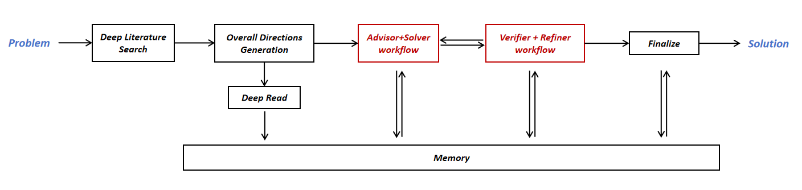
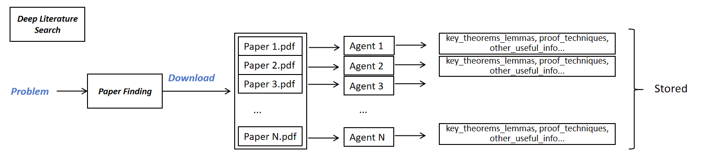
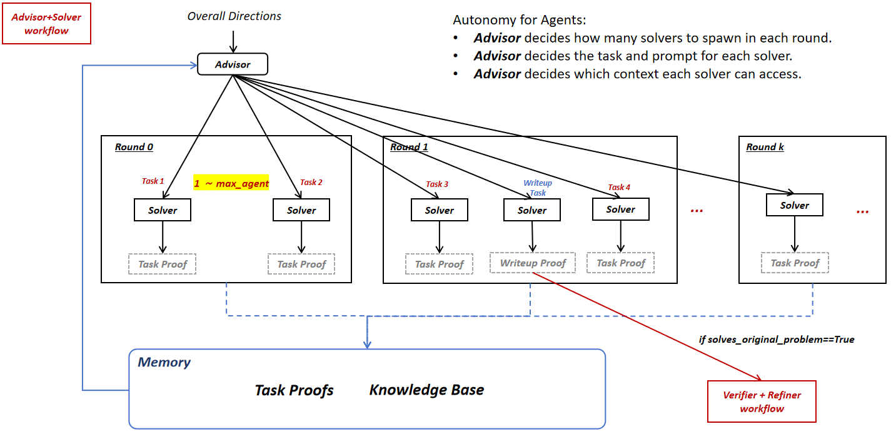
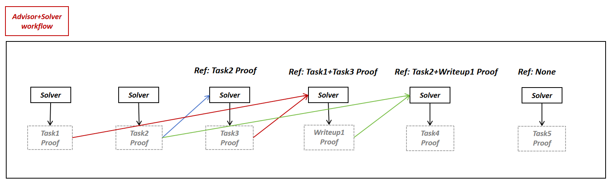
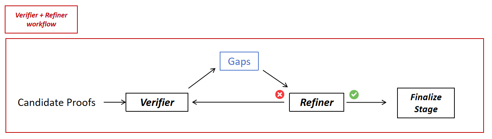

# FirstProof Second Batch Submission


### Repository layout

```
├── Dockerfile
├── hardware.json
├── README.md
├── requirements.txt
└── src/
    ├── entrypoint.py  
    ├── run_parallel_harness.py 
    ├── harness_0518_Final.py 
    ├── deep_read.py
    ├── finalize.py
    ├── literature_research.py
    ├── rate_limiter.py
    └── verifier_v2/      
```

All source code lives under `src/`. The Dockerfile copies `src/` to `/app/src/`
and runs `python -u src/entrypoint.py` as the container `CMD`.


### Quick Start

1. Put the math problems in `./input/input.json`. **Place the `my-secrets.env` file containing the OPENAI_API_KEY in `./`.**

```
├── Dockerfile
├── hardware.json
├── README.md
├── requirements.txt
├── src/
├── input/        
    └── input.json    <- math problems
└── my-secrets.env    <- OpenAI Key
```

- my-secrets.env:
```
OPENAI_API_KEY=sk-...
```


2. Build your image
```
docker build -t my-submission .
```

3. Run against the input file from this repo
```
docker run -d --rm \
  -v $(pwd)/input/input.json:/data/input/input.json:ro \
  -v $(pwd)/my-output:/data/output \
  --env-file my-secrets.env \
  my-submission
```

4. Check that output files appear
```
ls my-output/
```


### Submission contract

The container reads `input/input.json`. All intermediate outputs are in `/my-output`. 

**In the end, it will produce ten `.tex` solutions for all problems, as well as a `solutions.json` file that combines all solutions into one file** and a `total_usage.json` file that records the token costs for this run.


- input.json:
```json
{
  "problems": [
    { "id": "prob-001", "latex": "..." },
    { "id": "prob-002", "latex": "..." },
    ...
  ]
}
```

- outputs:

```
my-output
├── _harness_runs/     <- intermediate outputs
├── prob-001.tex       <- solution for prob-001
├── prob-002.tex       <- solution for prob-002
├── ...
├── prob-010.tex       <- solution for prob-010
├── solutions.json     <- all solutions in one file
└── total_usage.json   <- token costs
```


### Hardware request (`hardware.json`)

| Field | Value | Reason |
|---|---|---|
| `instance_type` | `r7i.2xlarge` | r7i.2xlarge is a decent instance that fits this orchestration footprint once ~10 Python interpreters overlap. |
| `timeout_minutes` | `1440` | The 1440-minute (24-hour) timeout is set for a single problem. Because problems run in parallel, the same timeout budget applies to the entire batch. |
| `env_vars` | `true` | `OPENAI_API_KEY` is required. |


# Harness Overview


Our harness is based on the `GPT-5.5 Pro` model.


**The following provides the overall framework and brief illustrations of our workflow.**

- **Overall Framework:**




- **Deep Literature Search:**



- **Advisor-Solver workflow:**






- **Verifier + Refiner workflow:**




